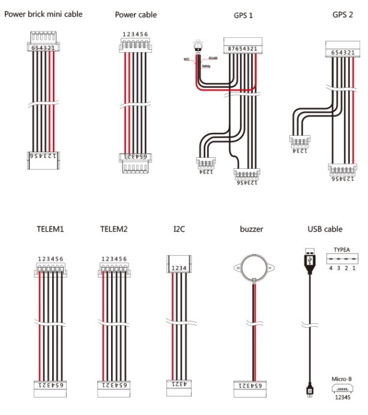

# Autopilot
The autopilot chosen was the Cube Purple, as being "good enough" for a rover type application.

## Parts
This was ordered as a kit, Cube Purple, mini-carrier, cables. 
Most of the cables were unsuitable for use with Ardusimple.

### Cables and Connectors
Connector information can be found [here](https://docs.cubepilot.org/user-guides/carrier-boards/mini-carrier-board).
Out of the box, the signal connectors are JST-GH 1.25 pitch on the mini-carrier side. 
On the other side they are Molex DF13 4P/5P/6P. The power cables are Molex CLIK-Mate 2 mm (6-pin).

### GPS1
The cable which came with the Cube did not have a JST-GH connector. 
Serial3/UART3 is for GPS1 and direction is from the perspective of the Cube.

|Pin|Name|Direction|Voltage|Color|
|---|---|---|---|---|
|1|VCC 5VDC|IN|5V|Red
|2|Serial 3 RX|IN|3.3-5V|Black
|3|Serial 3 TX|OUT|3.3-5V|Black
|4|I2C SCL|IN|3.3|Black
|5|I2C SDA|IN/OUT|3.3|Black
|6|Button| |GND|Black
|7|LED| |GND|Black
|8|GND| |GND|Black

On the Ardusimple, there is a 6 pin JST-GH connector. I took a generic JST-GH 6 to 6 and cut off one end.
I then connected the four wires required using solder & heatshrink.
This table is from the perspective of the Ardusimple ZED9P.

|Pin|Name|Direction|Voltage|
|---|---|---|---|
|1|VCC 5VDC|IN|5V|
|2|ZED-F9P UART1 RX|IN|3.3|
|3|ZED-F9P UART1 TX|OUT|3.3|
|4|Not connected| |GND|
|5|Not connected| |GND|
|6|GND|IN|GND|

### GPS2
This was a JST-GH 6 to 6 cable.

### Telemetry
There is no telemetry link, this needs to be ordered separately.
This was ordered from 3DXr as Holybro - Telemetry Radio Set V3 - 100mw 433MHz
Code: HB-03-14-433-100mw-V3.

On the laptop side, set to 57600.

## Physical Installation
1. Place the Cube on its carrier board.
   Ensure the Cube has an SDCard installed, mine came with a 16GB card preinstalled.
2. Install Mission Planner (MP) on a new Windows 10 VM, I am using VMWare Workstation, it works fine.
3. Plug the USB cable into the host laptop.
4. In VMWare, link the device to the VM.

# Wiring
1. Connect the servo cables, BLACK to the bottom pin.

