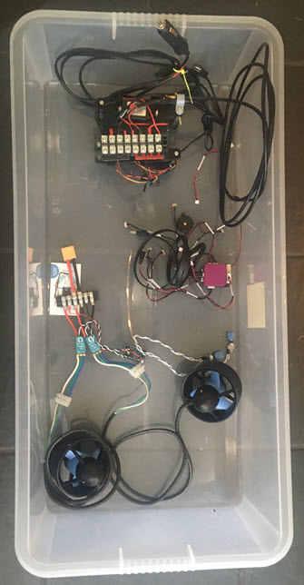

# Boat and Submersible
Despite all the really good videos and notes on the Internet, I have yet to find a single, 
idiot's guide to building an **Autonomous Surface Vehicle (ASV)** or 
an **Autonomous Underwater Vehicle (AUV)**. 
This repo contains all notes and code for the Arduboat based ASV, the first step to an AUV.
Apart from being a central repo, this material is mostly public domain, 
please treat it as licensed to Creative Commons (CC BY 4.0).
If you copy or share the information, you must attribute it to its source (here!).
Anthing complete for alpha test will be marked so.
Anything else will be marked as **Work-in-Progress (WIP)** or **Not Started**.

A bill of material (BOM) will only be completed when an alpha vessel first sets sail.

In Ireland, we prefix Long Eireannach (LE) to the name of a boat, 
in the same way as the English use HMS and the USA uses (USS).

**LE Tupperware** is the REV 0.0 frame and no expense has been spared in its engineering. 

## Subsystems
Go back to manufacturer's documentation in every case.
The notes below are mostly the "gotchas", those things that are not obvious until you start the build.

### 1. Cube Autopilot - WIP
This was ordered as a kit, Cube Purple, mini-carrier, cables.
There is no telemetry link, this needs to be ordered separately. 
1. Place the Cube on its carrier board.
   Ensure the Cube has an SDCard installed, mine came with a 16GB card preinstalled.
2. Install Mission Planner (MP) on a new Windows 10 VM, I am using VMWare Workstation, it works fine.
3. Plug the USB cable into the host laptop.
4. In VMWare, link the device to the VM.

### 2. Control PC and Mission Planner - WIP
Do NOT press the connect button in MP yet, just make sure the port is detected.
When you connect the Cube via USB, the red LED flashes rapidly.

1. In MP, **Settings -> Install Firmware -> Rover** (works for boat as well).
   When you are programming (c. 5 mins) the red LED on the cube is constant.
   If the bleeper is attached, it warbles when complete.
2. Unplug the unit briefly, then plug back in. 
   The unit warbles.
   My unit came up on a new COM port.
   I press **Connect** and it does.
3. After this, the menus etc. work fine, you can continue to configure.
4. The **Setup->Frame Type** does not give a boat option!!
   **Config->Full Parameter Tree->FRAME_CLASS** and set to 2, then **Write Params**.
5. Go to **Setup->Mandatory Hardware->Accel Calibration** and go through the Calibrate Accel procedure. 
   The result is not intuitive, banking seems reversed, but this is correct (think about it!!).
6. The Cube Purple does not have a working compass chip, it is disabled. 
   You will either need a compass in the GNSS, or you will add a compass board later.

### 3. GNSS with heading and Inertial Navigation System (INS) - WIP 
The cables which come out-of-the-box with the cube are JST-GH type, 4 and 6 pin for the GNSS.
Unfortunately, the Sparkfun boards only have a QWIK connector output, and I have not found a conversion cable.
For the moment, I have not tested any cable-kludging.
The Ardusimple boards have a JST connector natively, and I will be testing them *real soon*.
The menus do mention UBX ZED-9P but do not mention the ZED-9R. 
Both options are still to be tested.
An option using OpenINS is also to be tested ++later.

### 4. Blue Robotics Components - WIP
A basic kit has been purchased and assembled with a motor controller, all the instructions are included.
There is no independent PSU for 5VDC equipment, a power adapter needs to be separately purchased.
The power adapter cables also need to be ordered separately.

### 5. On board computer - WIP
A RPi 4B will be connected to the system eventually as an onboard computer.
Early research done.

### 6. LIDAR - Not Started

### 7. Cameras suited for photogrammetry - Not Started

### 8. Single Beam Echo Sounder (SBES) - Not Started

### 9. Side Scan (SS) - Not Started

### 10. Radio Remote Control (RC) - Not Started
